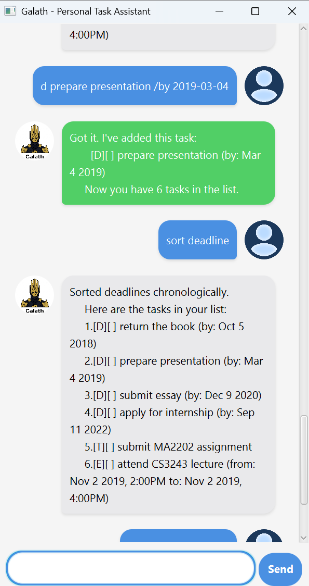

# Galath - Personal Task Assistant

> "The secret of getting ahead is getting started." – Mark Twain

Galath is a powerful yet simple task management chatbot that helps you organize your life through an intuitive command-line or graphical interface. Never forget a deadline or miss an important event again!


*Screenshot: Galath GUI in action*

---

## ✨ Features

- [x] **Multiple Task Types** - Todos, Deadlines, and Events with date/time support
- [x] **Smart Date Parsing** - Flexible date formats (`2024-12-25` or `2024-12-25 1400`)
- [x] **Command Aliases** - Use shortcuts like `t`, `d`, `e` for faster interaction
- [x] **Search Functionality** - Find tasks by keyword or date
- [x] **Sort Options** - Organize by name, date, or type
- [x] **Persistent Storage** - Auto-saves all changes to disk
- [x] **Beautiful GUI** - Modern JavaFX interface with chat bubbles
- [x] **CLI Support** - Use the command-line for terminal enthusiasts
- [ ] **Task Priorities** *(coming soon)*
- [ ] **Reminders** *(coming soon)*
- [ ] **Tags and Categories** *(coming soon)*

---

## 🚀 Getting Started

### Prerequisites

- Java 17 or higher
- JavaFX SDK 17 (for GUI version)
- Gradle or Maven (optional, for building)

### Installation

```bash
# Clone the repository
git clone https://github.com/DanielQ13/ip.git
cd ip

# Build with Gradle
./gradlew build
./gradlew run

# Or with Maven
mvn clean package
mvn javafx:run
```

---

## 📖 Usage

### GUI Mode

Launch the application and interact through the chat interface:

```
Hello! I'm Galath
What can I do for you?
```

Type commands in the input field and press Enter or click Send.

### CLI Mode

Run with the `--cli` flag for terminal mode:

```bash
java -jar galath.jar --cli
```

---

## 🎯 Command Reference

### Quick Start Commands

| Command | Alias | Description | Example |
|---------|-------|-------------|---------|
| `todo TASK` | `t` | Add a simple task | `todo read book` |
| `deadline TASK /by DATE` | `d` | Add task with deadline | `deadline submit report /by 2024-12-25` |
| `event TASK /from START /to END` | `e` | Add scheduled event | `event meeting /from 2024-12-25 1400 /to 1600` |
| `list` | `l`, `ls` | Show all tasks | `list` |
| `mark INDEX` | `m` | Mark task as done | `mark 1` |
| `unmark INDEX` | `u` | Mark task as not done | `unmark 1` |
| `delete INDEX` | `del`, `rm` | Delete a task | `delete 2` |
| `find KEYWORD` | `f` | Search tasks | `find book` |
| `on DATE` | - | Tasks on specific date | `on 2024-12-25` |
| `bye` | `exit` | Exit application | `bye` |

### Advanced Commands

#### Sorting

```bash
sort name      # Sort alphabetically
sort deadline  # Sort deadlines chronologically
sort event     # Sort events chronologically
sort type      # Group by type (Todo, Deadline, Event)
```

#### Date Formats

Galath accepts flexible date/time formats:

- **Date only**: `2024-12-25` (defaults to midnight)
- **Date with time**: `2024-12-25 1400` (2:00 PM)

Output formats:
- **Date only**: `Dec 25 2024`
- **With time**: `Dec 25 2024, 2:00PM`

---

## 💡 Usage Examples

### Example 1: Daily Task Management

```bash
# Add some tasks
t buy groceries
d submit assignment /by 2024-12-20
e team meeting /from 2024-12-18 1400 /to 2024-12-18 1500

# Check your list
list
     Here are the tasks in your list:
     1.[T][ ] buy groceries
     2.[D][ ] submit assignment (by: Dec 20 2024)
     3.[E][ ] team meeting (from: Dec 18 2024, 2:00PM to: 3:00PM)

# Complete a task
m 1
     Nice! I've marked this task as done:
       [T][X] buy groceries

# Sort by deadline
sort deadline
     Sorted deadlines chronologically.
```

### Example 2: Finding Tasks

```bash
# Search for tasks containing "book"
find book
     Here are the matching tasks in your list:
     1.[T][ ] read book
     2.[D][ ] return book (by: Dec 25 2024)

# Find tasks on a specific date
on 2024-12-25
     Here are the tasks on Dec 25 2024:
     1.[D][ ] return book (by: Dec 25 2024)
     2.[E][ ] Christmas dinner (from: Dec 25 2024, 6:00PM to: 9:00PM)
```

---

## 🏗️ Architecture

### Project Structure

```
galath/
├── src/
│   ├── main/
│   │   ├── java/
│   │   │   ├── Launcher.java
│   │   │   └── galath/
│   │   │       ├── Galath.java
│   │   │       ├── command/          # Command pattern classes
│   │   │       ├── exception/        # Custom exceptions
│   │   │       ├── gui/              # JavaFX GUI components
│   │   │       ├── parser/           # Command parser
│   │   │       ├── storage/          # File I/O
│   │   │       ├── task/             # Task models
│   │   │       └── ui/               # UI interface
│   │   └── resources/
│   │       ├── css/                  # Stylesheets
│   │       ├── images/               # Icons and avatars
│   │       └── view/                 # FXML layouts
│   └── test/
│       └── java/                     # Unit tests
├── data/
│   └── galath.txt                    # Persistent storage
└── docs/                             # Documentation
```

---

## 🧪 Testing

Run the test suite:

```bash
# With Gradle
./gradlew test

# With Maven
mvn test
```

### Test Coverage

- Unit tests for all Task classes
- Parser command validation tests
- Storage persistence tests
- Command execution tests

---

## 🛠️ Technology Stack

- **Language**: Java 17
- **GUI Framework**: JavaFX 17
- **Build Tools**: Gradle / Maven
- **Testing**: JUnit 5
- **Date/Time**: Java Time API (java.time)
- **Storage**: File-based (plain text)

---

## 🙏 Acknowledgments

- Inspired by the [Duke](https://nus-cs2103-ay2526-s2.github.io/website/se-book-adapted/projectDuke/index.html) project from NUS CS2103T
- Special thanks to the CS2103T teaching team